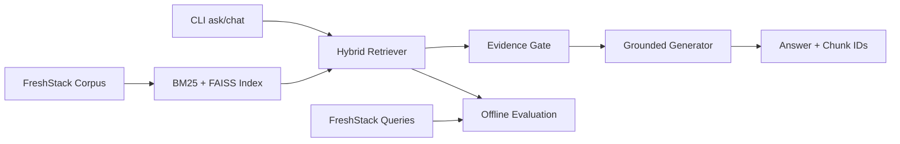

# Project Context

## Purpose

Technical Knowledge Assistant is a Python RAG prototype for technical LangChain questions.
It retrieves only from the FreshStack October 2024 LangChain corpus, returns corpus chunk
IDs as sources, and refuses when selected evidence is insufficient.

## Non-Negotiable Boundaries

- Search and generation context may use only `freshstack/corpus-oct-2024`, subset
  `langchain`.
- `freshstack/queries-oct-2024`, subset `langchain`, is evaluation-only. Reference answers,
  nuggets, and relevance judgments must never enter the assistant's retrieval or generation
  inputs.
- Use the repository-local environment created by `uv sync`; run commands with `uv run`.
- Do not commit `.env` or credentials.

## Maintenance

- Keep `CONTEXT.md` current after material changes so contributors can find the project
  boundaries, validation status, and next work without reconstructing them from source.
- Keep behavior, commands, results, decisions, and unresolved work in their respective
  README, results, ADR, and future-work documents.

## Architecture



- `data/`: normalize corpus records. FreshStack `_id` is the citation ID.
- `indexing/`: persist chunks, BM25, FAISS, and a manifest under `.rag-index`.
- `retrieval/`: BM25 and dense search fused with reciprocal-rank fusion.
- `generation/`: extractive mode, Ollama, or OpenAI-compatible generation.
- `evaluation/`: deterministic split plus retrieval and generated-answer metrics with JSON
  results.
- `cli.py`: `status`, `index`, `ask`, `chat`, `evaluate`, and `evaluate-answers` commands.

## Runtime Defaults

- Python 3.11; dependency workflow: `uv sync --extra dev`.
- Embeddings: `BAAI/bge-small-en-v1.5`.
- Retrieval: 40 candidates, top 8 results.
- Local provider option: Ollama at `http://localhost:11434/v1`, typically
  `qwen2.5:7b`.
- Evidence gate: at least two meaningful question terms must occur in a retrieved chunk.
  This is a provisional lexical guard, not a calibrated final relevance model.
- Generation bounds: 12,000 total context characters, 4,000 characters per chunk, and 512
  output tokens.
- Answer evaluation: a default 25-query development subset, 50% lexical nugget-coverage
  threshold, citation-identity metrics, and refusal metrics.

## Current State

- Corpus indexing, one-shot CLI, interactive CLI, Ollama integration, and refusal behavior
  are implemented.
- Generated answers must retain an inline citation from selected evidence; otherwise the
  assistant returns the cited extractive fallback. A model-declared lack of evidence becomes
  the standard refusal. Claim-level citation support is not yet measured.
- The existing local index contains corpus chunks and BM25/FAISS artifacts. Rebuild only if
  indexed text, chunking, tokenizer, or embedding model changes.
- Retrieval development evaluation is complete for 142 queries at $k=8$:
  - Recall@8: 0.1525
  - MRR@8: 0.3797
  - nDCG@8: 0.1995
- The final evaluation partition is intentionally untouched.
- Ollama integration works. Hosted OpenAI-compatible testing returned HTTP 429.
- A 25-query Ollama generated-answer evaluation completed on the development partition:
  - Nugget coverage: 0.3378
  - Inline citation presence: 0.0400
  - The initial generated mode was insufficient for grounded use; see the results report.

## Important Commands

```powershell
uv sync --extra dev
uv run pytest -q
uv run ruff check .
uv run rag-assistant status
uv run rag-assistant index
uv run rag-assistant ask "How do I invoke a LangChain runnable?"
uv run rag-assistant chat
uv run rag-assistant evaluate --partition development
uv run rag-assistant evaluate-answers --partition development
```

To use Ollama, set `LLM_PROVIDER=ollama` and `LLM_MODEL=qwen2.5:7b` in `.env`, then ensure
the Ollama service and model are available.

## Key Documents

- [README.md](README.md): setup, commands, and architecture overview.
- [docs/adr](docs/adr): durable architecture decisions.
- [docs/results-report.md](docs/results-report.md): measured development retrieval and
  generated-answer results.
- [docs/future-work.md](docs/future-work.md): planned reliability and quality improvements.
- [results/retrieval-development.json](results/retrieval-development.json): per-query
  development rankings and metrics.

## Next Work

1. Compare BM25-only, dense-only, and hybrid retrieval; tune context and evidence-gate
  settings only on the development split.
2. Re-run generated-answer evaluation after each selected grounding change. Add a
  claim-level citation-support evaluation before treating generated answers as reliable.
3. Lock configuration, run the final split once, and update the results report with final
  retrieval, answer, citation, refusal, latency, and example results.