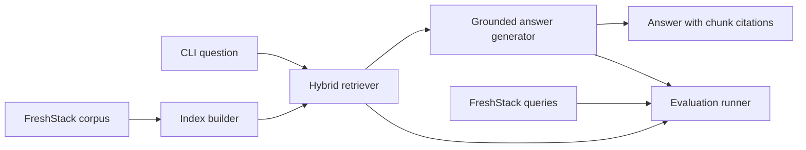

# Technical Knowledge Assistant

A retrieval-augmented generation (RAG) prototype for answering LangChain technical
questions from the FreshStack October 2024 corpus. The assistant uses only indexed
corpus content, returns supporting chunk IDs, and declines to answer when evidence is
insufficient.

## Note on Authorship and Scope

AI generated most of this proof-of-concept code. The author reviewed most of the
implementation, while the architecture and design decisions were human-led. Clear
documentation plus unit and integration tests are required here so the behavior can be
inspected and trusted. The project uses a fully modular design and might seem bigger than required, 
however this is by design to allow all stages to be hotswappable/reusable.

This is a time-capped PoC. It uses a local Ollama model to make testing practical, so its
quality results are not representative of a production system using a stronger, properly
evaluated model.

## Architecture



The code is organized by responsibility:

- `src/technical_knowledge_assistant/data`: FreshStack dataset loading and normalized records.
- `src/technical_knowledge_assistant/indexing`: sparse and dense index construction.
- `src/technical_knowledge_assistant/retrieval`: hybrid retrieval.
- `src/technical_knowledge_assistant/generation`: grounded prompting and LLM providers.
- `src/technical_knowledge_assistant/evaluation`: split management and retrieval, answer, and citation metrics.
- `src/technical_knowledge_assistant/cli.py`: index, ask, chat, and evaluate commands.
- `docs/adr`: Architecture Decision Records.

## Current Status

The project includes corpus loading, BM25/FAISS hybrid indexing, retrieval, grounded answer
generation, a CLI, and offline evaluation. The code is organized into data, indexing,
retrieval, generation, and evaluation modules; the CLI wires them together.

Generated answers must cite selected evidence. When a model does not provide a valid cited
answer, the assistant returns compact cited excerpts instead. Claim-level citation support
remains future work. See [docs/results-report.md](docs/results-report.md) for the development
baseline and its limitations.

## Setup

Requires Python 3.11 or newer and [uv](https://docs.astral.sh/uv/).

```sh
uv sync --extra dev
cp .env.example .env
```

On Windows PowerShell, replace `cp` with `Copy-Item`. `uv sync` creates the repository-local
`.venv` and installs the locked dependencies. Run commands through that environment:

```sh
uv run pytest
uv run rag-assistant --help
```

Build the local index. The first run downloads the corpus and embedding model, then writes
BM25, FAISS, and chunk mapping artifacts to `.rag-index`:

```sh
uv run rag-assistant index
```

Ask a question:

```sh
uv run rag-assistant ask "How do I invoke a LangChain runnable?"
```

For several questions in one session, use the interactive CLI. It loads the index and
embedding model once; type `exit` or `quit` to end the session.

```sh
uv run rag-assistant chat
```

## Generation

- `LLM_PROVIDER=none` is the default and returns cited corpus excerpts without a model API key.
- `LLM_PROVIDER=ollama` is the preferred local synthesized-answer option.
- `LLM_PROVIDER=openai` supports hosted endpoints compatible with OpenAI Chat Completions.
- Context and output are bounded by configurable character and token limits to keep local
	generation responsive.

For Ollama, install [Ollama](https://ollama.com/download), pull a model, and ensure its local
service is running:

```sh
ollama pull qwen2.5:7b
ollama serve
```

Set the following values in your local `.env` file. `ollama serve` is unnecessary when the
Ollama desktop application is already running.

```env
LLM_PROVIDER=ollama
LLM_MODEL=qwen2.5:7b
OLLAMA_BASE_URL=http://localhost:11434/v1
```

Ollama uses its OpenAI-compatible local `/v1/chat/completions` endpoint and requires no API
key. To use a hosted OpenAI-compatible endpoint instead, set these values in `.env`. Do not
commit an API key.

```env
LLM_PROVIDER=openai
LLM_MODEL=<provider-model-name>
OPENAI_API_KEY=<provider-api-key>
OPENAI_BASE_URL=https://api.openai.com/v1
```

`OPENAI_BASE_URL` can target another provider only when it supports the OpenAI Chat
Completions API contract. Confirm the active mode without exposing credentials:

```powershell
uv run rag-assistant status
```

The generator sends only the user question and retrieved corpus chunks to the configured
endpoint. A generated response without a valid inline citation, or a model refusal despite
selected evidence, falls back to cited excerpts. The standard refusal is used when no
sufficient evidence is selected.

## Retrieval Evaluation

The evaluation command uses `freshstack/queries-oct-2024` only for offline measurement;
query answers and nuggets are never provided to the assistant. It deterministically splits
the LangChain query set into development and final partitions using `EVALUATION_SEED` and
`DEVELOPMENT_FRACTION` from `.env`.

Use the development partition to choose retrieval parameters:

```sh
uv run rag-assistant evaluate --partition development
```

Once retrieval settings are fixed, run the final partition once:

```sh
uv run rag-assistant evaluate --partition final
```

Each run writes `results/retrieval-<partition>.json` with ranked chunk IDs for every query
and aggregate Recall@$k$, MRR@$k$, and nDCG@$k$.

With a configured generation provider, evaluate a fixed development subset of generated
answers. This command passes only questions and retrieved corpus evidence to the assistant;
nuggets and reference answers are used afterward for scoring.

```sh
uv run rag-assistant evaluate-answers --partition development
```

The default subset is 25 queries. Use `--limit 0` only when evaluating the full selected
partition. It writes `results/answers-<partition>-<count>.json` and reports lexical nugget
coverage, inline citation presence and validity, and supported/unsupported refusal rates.
These are transparent prototype metrics, not claim-level factuality proofs. See
[docs/results-report.md](docs/results-report.md) for the measured retrieval and generated-
answer development results.

Run `rag-assistant --help` to view all commands.

## Decisions

See [docs/adr](docs/adr) for the recorded architectural decisions and their consequences.
Known limitations and planned improvements are tracked in
[docs/future-work.md](docs/future-work.md).

## Results Summary

These development tests used FreshStack data. Reference answers and relevance judgments were
used only after answering to measure quality.

1. **Retrieval test:** On 142 questions, hybrid retrieval achieved Recall@8 of `0.1525`,
	MRR@8 of `0.3797`, and nDCG@8 of `0.1995`. It found some relevant chunks early, but missed
	much of the judged evidence.
2. **Initial local-Ollama answer test:** On 25 questions, lexical nugget coverage was `0.3378`,
	but only one answer included an inline citation. This was not sufficiently grounded.
3. **Citation and fallback test:** On the same 25 questions, every delivered answer included a
	valid selected-source citation ID, but nugget coverage fell to `0.0946` and `44%` of
	supported questions were refused. This improved source identity but not answer usefulness.

	Possible improvement areas include:

	- Using a frontier or otherwise better model.
	- Improving chunking.
	- Using a better embedding model.
	- Validating different chunk retrieval methods.
	- Validating against cloud-native solutions.
	- Improving the code's functionality and the patterns it uses.

These are PoC baselines, not production-quality claims. The held-out final partition has not
been evaluated. Full methodology and limitations are in
[docs/results-report.md](docs/results-report.md).