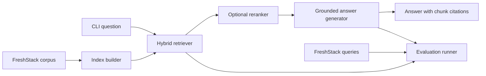

# Technical Knowledge Assistant

A retrieval-augmented generation (RAG) prototype for answering LangChain technical
questions from the FreshStack October 2024 corpus. The assistant uses only indexed
corpus content, returns supporting chunk IDs, and declines to answer when evidence is
insufficient.

## Architecture



The code is organized by responsibility:

- `src/technical_knowledge_assistant/data`: FreshStack dataset loading and normalized records.
- `src/technical_knowledge_assistant/indexing`: sparse and dense index construction.
- `src/technical_knowledge_assistant/retrieval`: hybrid retrieval and optional reranking.
- `src/technical_knowledge_assistant/generation`: grounded prompting and LLM providers.
- `src/technical_knowledge_assistant/evaluation`: split management and retrieval, answer, and citation metrics.
- `src/technical_knowledge_assistant/cli.py`: index, ask, chat, and evaluate commands.
- `docs/adr`: Architecture Decision Records.

## Current Status

Corpus loading, hybrid indexing, retrieval, and grounded answer generation are implemented.
Retrieval evaluation is implemented; the current development baseline is reported in
[docs/results-report.md](docs/results-report.md). Answer-quality and citation-support
evaluation remain future work while hosted generation is unavailable.

## Setup

Requires Python 3.11 or newer.

```powershell
uv sync --extra dev
Copy-Item .env.example .env
```

`uv sync` creates the repository-local `.venv` from the pinned Python 3.11 runtime and
installs the locked runtime and development dependencies. Run commands through that
environment so they cannot accidentally use system Python:

```powershell
uv run pytest
uv run rag-assistant --help
```

Build the local index. The first run downloads the corpus and embedding model, then writes
BM25, FAISS, and chunk mapping artifacts to `.rag-index`:

```powershell
uv run rag-assistant index
```

Ask a question:

```powershell
uv run rag-assistant ask "How do I invoke a LangChain runnable?"
```

For several questions in one session, use the interactive CLI. It loads the index and
embedding model once; type `exit` or `quit` to end the session.

```powershell
uv run rag-assistant chat
```

With the default `LLM_PROVIDER=none`, the CLI returns cited corpus excerpts without a model
API key. For local synthesized answers, install [Ollama](https://ollama.com/download), pull
a model, and ensure its local service is running:

```powershell
ollama pull qwen2.5:7b
ollama serve
```

Set the following values in your local `.env` file. `ollama serve` is unnecessary when the
Ollama desktop application is already running.

```env
LLM_PROVIDER=ollama
LLM_MODEL=qwen2.5:7b
OLLAMA_BASE_URL=http://localhost:11434/v1
```

Ollama uses its OpenAI-compatible local `/v1/chat/completions` endpoint and requires no API
key. To instead use a hosted OpenAI-compatible endpoint, set these values in `.env`. Do not
commit an API key.

```env
LLM_PROVIDER=openai
LLM_MODEL=<provider-model-name>
OPENAI_API_KEY=<provider-api-key>
OPENAI_BASE_URL=https://api.openai.com/v1
```

`OPENAI_BASE_URL` can target another provider only when it supports the OpenAI Chat
Completions API contract. Confirm the active mode without exposing credentials:

```powershell
uv run rag-assistant status
```

The generator sends the user question and retrieved corpus chunks to the configured
endpoint. It is instructed to use only that context and cite every factual claim.

## Retrieval Evaluation

The evaluation command uses `freshstack/queries-oct-2024` only for offline measurement;
query answers and nuggets are never provided to the assistant. It deterministically splits
the LangChain query set into development and final partitions using `EVALUATION_SEED` and
`DEVELOPMENT_FRACTION` from `.env`.

Use the development partition to choose retrieval parameters:

```powershell
uv run rag-assistant evaluate --partition development
```

Once retrieval settings are fixed, run the final partition once:

```powershell
uv run rag-assistant evaluate --partition final
```

Each run writes `results/retrieval-<partition>.json` with ranked chunk IDs for every query
and aggregate Recall@$k$, MRR@$k$, and nDCG@$k$.

With a configured generation provider, evaluate a fixed development subset of generated
answers. This command passes only questions and retrieved corpus evidence to the assistant;
nuggets and reference answers are used afterward for scoring.

```powershell
uv run rag-assistant evaluate-answers --partition development
```

The default subset is 25 queries. Use `--limit 0` only when evaluating the full selected
partition. It writes `results/answers-<partition>-<count>.json` and reports lexical nugget
coverage, inline citation presence and validity, and supported/unsupported refusal rates.
These are transparent prototype metrics, not claim-level factuality proofs. See
[docs/results-report.md](docs/results-report.md) for the measured retrieval baseline.

Run `rag-assistant --help` to view all commands.

## Decisions

See [docs/adr](docs/adr) for the recorded architectural decisions and their consequences.
Known limitations and planned improvements are tracked in
[docs/future-work.md](docs/future-work.md).