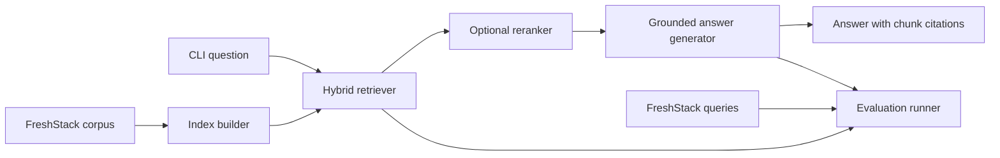

# Technical Knowledge Assistant

A retrieval-augmented generation (RAG) prototype for answering LangChain technical
questions from the FreshStack October 2024 corpus. The assistant uses only indexed
corpus content, returns supporting chunk IDs, and declines to answer when evidence is
insufficient.

## Architecture



The code is organized by responsibility:

- `src/technical_knowledge_assistant/data`: FreshStack dataset loading and normalized records.
- `src/technical_knowledge_assistant/indexing`: sparse and dense index construction.
- `src/technical_knowledge_assistant/retrieval`: hybrid retrieval and optional reranking.
- `src/technical_knowledge_assistant/generation`: grounded prompting and LLM providers.
- `src/technical_knowledge_assistant/evaluation`: split management and retrieval, answer, and citation metrics.
- `src/technical_knowledge_assistant/cli.py`: index, ask, chat, and evaluate commands.
- `docs/adr`: Architecture Decision Records.

## Current Status

Corpus loading, hybrid indexing, retrieval, and grounded answer generation are implemented.
Evaluation is the remaining major component.

## Setup

Requires Python 3.11 or newer.

```powershell
uv sync --extra dev
Copy-Item .env.example .env
```

`uv sync` creates the repository-local `.venv` from the pinned Python 3.11 runtime and
installs the locked runtime and development dependencies. Run commands through that
environment so they cannot accidentally use system Python:

```powershell
uv run pytest
uv run rag-assistant --help
```

Build the local index. The first run downloads the corpus and embedding model, then writes
BM25, FAISS, and chunk mapping artifacts to `.rag-index`:

```powershell
rag-assistant index
```

Ask a question:

```powershell
rag-assistant ask "How do I invoke a LangChain runnable?"
```

With the default `LLM_PROVIDER=none`, the CLI returns cited corpus excerpts without a model
API key. To synthesize an answer through an OpenAI-compatible endpoint, set
`LLM_PROVIDER=openai`, `LLM_MODEL`, and `OPENAI_API_KEY` in `.env`. The generator is
instructed to use only retrieved chunks and cite every factual claim.

Run `rag-assistant --help` to view all commands.

## Decisions

See [docs/adr](docs/adr) for the recorded architectural decisions and their consequences.
Known limitations and planned improvements are tracked in
[docs/future-work.md](docs/future-work.md).